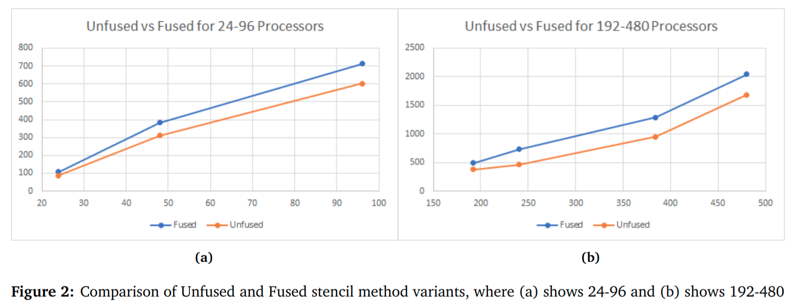

# ALIEV-PANFILOV CARDIAC SIMULATION USING MPI

Description
===========
Simulations play an important role in science, medicine, and engineering. In this project we perform a cardiac electrophysiology simulation, which models electrical signals in a system in which voltages vary at discrete points in time and at the discrete positions of a mesh. The simulation involves solving a coupled set of Ordinary Differential Equations (ODEs) together with a Partial Differential Equation (PDE).In this project, we make effort to parallelize the Aliev-Panfilov Cardiac simulation over multiple cores using MPI(message passing interface). We were able to achieve more than 2 TF for a mesh of size 8000 with 480 cores on the supercomputer cluster COMET.

Code organization
=================
* solve.cpp - implements Aliev-Panfilov Cardiac over MPI. use makefile to compile
* helper.cpp - setups initial conditons and distrbutes the problems to multiple cores

Results
=================

Acknowledgements
================
I thank Prof. Bryan Chin and TAs for their guidance and support.

